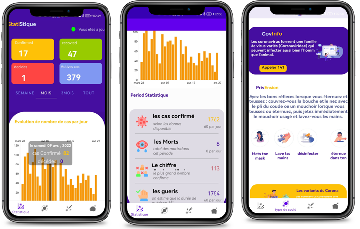

# covInfo
## Covid Stats Morocco
Covid Stats Morocco est une application mobile Android conçue pour sensibiliser les gens sur le COVID-19 au Maroc. Elle utilise l'API de statistiques sur le COVID-19 au Maroc pour mettre à jour les chiffres en temps réel.

## Fonctionnalités
Les dernières statistiques sur le COVID-19 au Maroc, avec des graphiques et des tableaux de données.
Des informations sur les types de vaccins disponibles et les campagnes de vaccination en cours.
Un modèle de machine learning qui permet aux utilisateurs de savoir leur risque d'infection par le COVID-19.
## Screenshot of Covid Stats Morocco

## Technologies
Covid Stats Morocco a été développé en utilisant Kotlin et l'API de statistiques sur le COVID-19 au Maroc.

#devloppement et ressources 
Notre modèle de machine learning a été développé en utilisant les langages Python et Scala. Nous avons entraîné notre modèle sur un jeu de données en utilisant l'algorithme d'arbre de décision. Notre modèle permet aux utilisateurs de connaître leur risque d'infection par le COVID-19 en fonction de différents facteurs.
## technologies et outils 

-Kotlin

-API de statistiques sur le COVID-19 au Maroc

-Python

-Scala

-Algorithme d'arbre de décision

-AndroidX

-MVVM

-Coroutines Kotlin

-Retrofit

-MPAndroidChart

-PMML4s

#
Pour développer notre application et notre modèle de machine learning, nous avons utilisé plusieurs ressources, notamment les documents de développement d'Android (https://developer.android.com/docs), la documentation de Kotlin (https://kotlinlang.org/docs/android-overview.html), les bibliothèques AndroidX (https://developer.android.com/jetpack/androidx/explorer), des tutoriels sur l'architecture MVVM sur Android (https://medium.com/androidmood/comprendre-larchitecture-mvvm-sur-androidaa285e4fe9dd), la documentation sur les coroutines Kotlin (https://developer.android.com/kotlin/coroutines), l'API de statistiques sur le COVID-19 au Maroc (https://api.covid19api.com/dayone/country/Morocco), des articles de recherche sur le COVID-19 (https://www.nature.com/articles/s41746-020-00372-6), un projet open source sur GitHub (https://github.com/nshomron/covidpred), une bibliothèque de réseau pour Android (https://square.github.io/retrofit/), une bibliothèque de graphiques pour Android (https://github.com/PhilJay/MPAndroidChart), une bibliothèque de conversion PMML en Scala (https://github.com/autodeployai/pmml4s), des forums de discussion en ligne (https://stackoverflow.com/), des tutoriels sur l'architecture Android (https://www.xenonstack.com/blog/kotlin-andriod, https://www.geeksforgeeks.org/android-architecture-patterns/), des articles sur les algorithmes d'arbre de décision (https://www.kdnuggets.com/2020/01/decision-tree-algorithm), la documentation sur la déclaration de layouts Android (https://developer.android.com/guide/topics/ui/declaring-layout), une base de données de vaccins contre le COVID-19 (https://pfecovinfo.000webhostapp.com/cvtp.php?table=vaccin), des ressources de design (https://dribbble.com/, 
